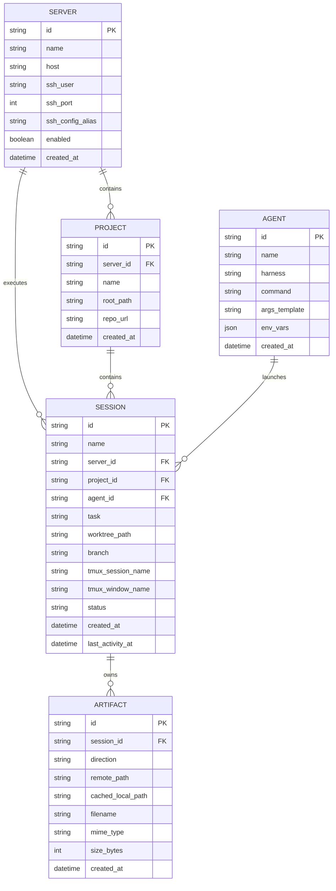
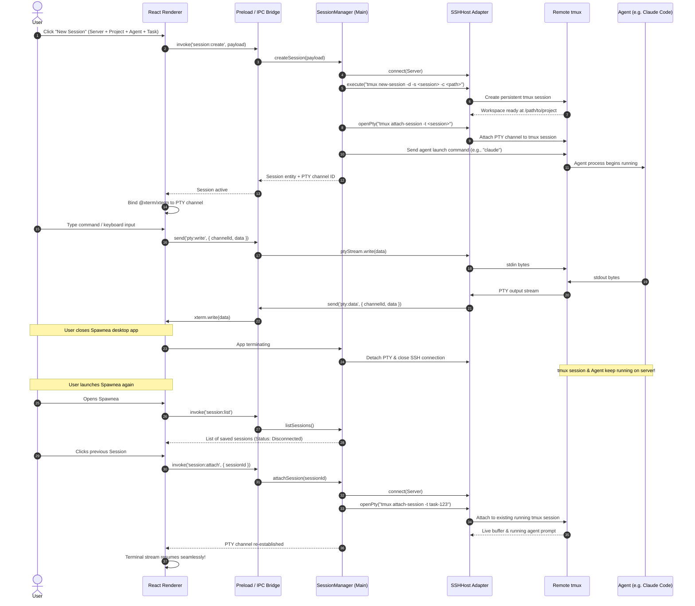

# Spawnea Architecture Specification

## 1. Executive Summary & Architectural Vision

Spawnea is a local-first desktop IDE designed to operate AI coding agents across multiple local and remote machines.

The product treats **persistent `tmux` sessions** as the execution surface, while the **active session** serves as the master context driver for the entire application—simultaneously synchronizing the terminal PTY, worktree files, Git diff inspection, session artifacts, and attention state.

### Core Architectural Axioms
1. **tmux as the Execution Core (Crash-proof & Zero Lock-in):** Long-running agents live inside native `tmux` sessions on standard Linux/SSH machines. Closing, updating, or crashing Spawnea does not kill running agents.
2. **Zero Required Remote Installation:** Spawnea operates on remote hosts without installing Spawnea software, background daemons, packages, plugins, hooks, or global configuration modifications (`~/.codex/`, `~/.claude/`, `~/.config/opencode/`, shell rc files, `/etc/`). For an already reachable SSH host, Spawnea-managed sessions require only `tmux` on the target; the configured agent command and its dependencies remain user-managed. Spawnea uses standard SSH, tmux, ps, POSIX utilities, and non-invasive inspections such as `tmux capture-pane`. No resident Spawnea process runs on the remote host.
3. **Zero Stored Credentials (Strict Security):** Spawnea **never** stores SSH private keys, server passwords, or secrets. All authentication delegates to `~/.ssh/config`, configured `IdentityAgent` or `SSH_AUTH_SOCK` sockets (SSH Agent / 1Password / GPG), and OS-level authentication. SSH server identity is verified strictly against the user's `~/.ssh/known_hosts`; unknown or changed keys fail the connection.
4. **Strict Process & Layer Isolation:** The Electron renderer is pure presentation (React UI). All filesystem, SSH, SQLite, PTY, and child process logic lives exclusively in the Electron Main process behind typed IPC boundaries.
5. **Multi-Agent TDD Baseline:** Because the codebase is developed by AI coding agents, all domain logic, state machines, database models, and adapter contracts are covered by automated unit/contract tests to prevent regressions.

---

## 2. System Component Diagram

```mermaid
graph TD
    subgraph UI ["Electron Renderer Process (React 19 + TypeScript + Tailwind)"]
        Nav[Sidebar & Navigation Rail]
        SessionContext[Active Session Context State]
        XTermPanel[@xterm/xterm Terminal View]
        FilePanel[Dired-Style File Tree]
        DiffPanel[Git Diff Viewer]
        ArtifactPanel[Artifact & Image Inspector]
        AttentionBadge[Attention State Badge]
    end

    subgraph Bridge ["Context-Isolated Preload Layer"]
        IPCBridge["window.spawneaApi (Typed IPC)"]
    end

    subgraph Main ["Electron Main Process (Node.js Core)"]
        subgraph CoreManagers ["Application Core"]
            SM[SessionManager]
            SD[StateDetector & Attention Engine]
            AM[ArtifactManager]
        end

        subgraph Adapters ["Interface Adapters"]
            HA[HostAdapter: LocalHost / SSHHost]
            WM[WorkspaceManager: GitWorktree]
            PTY[PTY Stream Broker & FlowControl]
        end

        subgraph Storage ["Local Persistence"]
            DB[(SQLite / better-sqlite3 + Drizzle)]
        end
    end

    subgraph TargetHost ["Target Execution Environment (Local or Remote Linux via SSH)"]
        SSHServer[OpenSSH Server]
        TMUX[Persistent tmux Sessions / Windows]
        WORKTREE[Git Worktrees / Repositories]
        AGENTS[AI Agents: Claude Code, Codex, Hermes, Shell]
    end

    UI --> SessionContext
    SessionContext --> XTermPanel
    SessionContext --> FilePanel
    SessionContext --> DiffPanel
    SessionContext --> ArtifactPanel
    SessionContext --> AttentionBadge

    UI <==>|Typed IPC Messages| IPCBridge
    IPCBridge <==>|IPC Main Handlers| SM
    IPCBridge <==>|Binary PTY Streams| PTY

    SM --> DB
    SM --> HA
    SM --> WM
    SM --> SD
    SM --> AM

    HA <==>|SSH2 / SFTP| SSHServer
    PTY <==>|SSH Channel / PTY| TMUX
    WM <==>|CLI Execution| WORKTREE
    TMUX --> AGENTS
```

---

## 3. Monorepo Package Boundaries (`pnpm workspaces`)

The codebase is organized into isolated, single-responsibility packages:

```text
spawnea/
├── apps/
│   └── desktop/                 # Electron application (Main process, Preload script, React Renderer)
│       ├── src/
│       │   ├── main/            # Electron lifecycle, IPC registration, service bootstrap
│       │   ├── preload/         # Typed contextBridge exposure
│       │   └── renderer/        # React 19 UI (Tabs, XTerm, FileTree, DiffView, Artifacts)
│
├── packages/
│   ├── domain/                  # Pure types, Zod schemas, constants (Zero external framework deps)
│   ├── db/                      # SQLite database connection, Drizzle schema, migrations, repositories
│   ├── hosts/                   # HostAdapter interface + LocalHost & SSHHost implementations (ssh2)
│   └── state/                   # Attention state detector and harness output parsers
│
├── docs/                        # Architecture specs, build strategy, backlog, task files
└── tooling/                     # Shared TypeScript configuration
```

### Module Dependency Hierarchy (Strict Unidirectional Flow)
* `apps/desktop` $\longrightarrow$ `packages/db`, `packages/hosts`, `packages/state`, `packages/domain`
* `packages/db`, `packages/hosts`, `packages/state` $\longrightarrow$ `packages/domain`
* `packages/domain` $\longrightarrow$ **No dependencies** (Pure TypeScript + Zod)

---

## 4. Domain Model & Entities

All domain models are defined in `packages/domain` with corresponding Zod validation schemas.



### Domain Types (`packages/domain/src/index.ts`)

```typescript
export type SessionStatus =
  | 'starting'
  | 'working'
  | 'needs_input'
  | 'idle'
  | 'done'
  | 'error'
  | 'disconnected';

export type ArtifactDirection = 'input' | 'output';

export interface Server {
  id: string;
  name: string;
  host: string;
  sshUser?: string;
  sshPort: number;
  sshConfigAlias?: string;
  enabled: boolean;
  createdAt: Date;
}

export interface Project {
  id: string;
  serverId: string;
  name: string;
  rootPath: string;
  repoUrl?: string;
  createdAt: Date;
}

export interface Agent {
  id: string;
  name: string;
  harness: string; // e.g. 'claude', 'codex', 'hermes', 'opencode', 'shell'
  command: string; // e.g. 'claude', 'hermes'
  argsTemplate?: string[]; // e.g. ['agent', 'example-agent-profile']
  envVars?: Record<string, string>;
  createdAt: Date;
}

export interface Session {
  id: string;
  name: string;
  serverId: string;
  projectId: string;
  agentId: string;
  task: string;
  worktreePath: string;
  branch: string;
  tmuxSessionName: string;
  tmuxWindowName?: string;
  status: SessionStatus;
  createdAt: Date;
  lastActivityAt: Date;
}

export interface Artifact {
  id: string;
  sessionId: string;
  direction: ArtifactDirection;
  remotePath: string;
  cachedLocalPath?: string;
  filename: string;
  mimeType: string;
  sizeBytes: number;
  createdAt: Date;
}
```

### Local MCP control boundary

The configurable MCP integration remains a main-process adapter, not a renderer or host concern. It is enabled by default and can be disabled explicitly for diagnostics or environments that do not want a local control socket. A dedicated stdio bridge authenticates to an owner-only Unix-domain socket and delegates typed operations to `AgentControlService`. Read DTOs are deliberately narrower than persisted host records and omit connection targets and credentials.

Destructive operations use an explicit finalization mode. Integrate and ordinary MCP requests create a pending request that only the trusted renderer preload may approve or reject over IPC. A close request may instead carry the authenticated MCP protocol signal `confirmation: "llm-validated"`; Main records `mode: "mcp-validated"`, skips the confirmation event, and delegates directly to the existing `SessionManager.finishSession` path. That origin is accepted only for close, and the same identity, worktree, branch, dirty-state, authorization, host, and Git guards remain authoritative. The complete versioned contract and threat model are documented in [`control-api-mcp.md`](control-api-mcp.md).

---

## 5. Adapter Interfaces (`packages/*`)

### 5.1 Host Abstraction (`packages/hosts`)
The `HostAdapter` interface hides whether operations run on the local machine or a remote machine over SSH.

```typescript
export interface FileEntry {
  name: string;
  path: string;
  isDirectory: boolean;
  isFile: boolean;
  size: number;
  modifiedAt: Date;
}

export interface FileStat {
  size: number;
  isDirectory: boolean;
  isFile: boolean;
  modifiedAt: Date;
}

export interface ExecResult {
  stdout: string;
  stderr: string;
  exitCode: number;
}

export interface PtyStream {
  id: string;
  onData(callback: (data: string) => void): () => void;
  write(data: string): void;
  resize(cols: number, rows: number): void;
  close(): void;
}

export interface HostAdapter {
  readonly serverId: string;
  connect(): Promise<void>;
  disconnect(): Promise<void>;
  isConnected(): boolean;
  execute(command: string, options?: { cwd?: string; env?: Record<string, string> }): Promise<ExecResult>;
  openPty(command: string, options: { cols: number; rows: number; cwd?: string; env?: Record<string, string> }): Promise<PtyStream>;
  upload(localPath: string, remotePath: string): Promise<void>;
  download(remotePath: string, localPath: string): Promise<void>;
  list(dirPath: string): Promise<FileEntry[]>;
  read(filePath: string): Promise<Buffer>;
  stat(filePath: string): Promise<FileStat>;
}
```

### 5.2 Git and tmux services
Git worktree operations and tmux lifecycle operations are implemented by services in `packages/hosts`; session orchestration lives in the Electron Main process.

The current implementation exposes these operations through `GitService`, `TmuxManager`, and `SessionManager`; there is no standalone `WorkspaceManager` package in the repository.

### 5.3 Attention State Detector (`packages/state`)

The `StateDetector` evaluates multi-source observable signals to infer normalized session attention state without requiring permanent remote software installation.

```text
SessionSignals
├── runtime / tmux state (session exists, pane dead/alive, foreground command, host reachable)
├── foreground process (agent process alive, shell process active, pid)
├── PTY activity (lastOutputAt, lastInputAt, recentOutputBytes)
├── terminal output snapshot (tmux capture-pane tail: prompt detection, generic/harness patterns)
├── process exit result (exit code, pane_dead)
└── no remote harness hook or event process required

SessionSignals ──► StateDetector ──► SessionStatusResult (status, confidence, source, detectedPrompt)
```

```typescript
export type StatusSource =
  | 'tmux'
  | 'process'
  | 'pty_activity'
  | 'terminal_prompt'
  | 'process_exit';

export interface SessionSignals {
  sessionId: string;
  hostReachable: boolean;
  tmuxSessionExists: boolean;
  paneExists: boolean;
  paneDead: boolean;
  paneCurrentCommand?: string;
  panePid?: number;
  isPtyAttached: boolean;
  lastOutputAt?: Date;
  lastInputAt?: Date;
  recentOutputBytes?: number;
  tailLines?: string[];
  matchedPrompt?: string;
  detectedPromptKind?: 'confirmation' | 'choice' | 'text_input' | 'shell_prompt' | 'none';
  exitCode?: number;
  harnessStatus?: string;
  harnessStatusSource?: string;
}

export interface SessionStatusResult {
  status: SessionStatus;
  confidence: number; // 0.0 to 1.0
  source: StatusSource;
  detectedPrompt?: string;
  reason: string;
  updatedAt: Date;
}

export interface StateDetector {
  detectStatus(signals: SessionSignals): SessionStatusResult;
}
```

The domain retains event-related source values for adapter and fixture compatibility, but the current desktop supervisor supplies no harness events. The runtime path is tmux/process inspection, PTY activity, and parsed terminal output.

#### Signal Precedence & Confidence
```text
process exit code (Confidence: 1.0)
        ↓
harness-specific output parser / capture-pane pattern (Confidence: 0.85)
        ↓
generic terminal prompt heuristics (Confidence: 0.75)
        ↓
PTY activity streaming (Confidence: 0.60)
        ↓
tmux / process liveness & foreground command (Confidence: 0.50)
```

---

## 6. Sequence: First Vertical Slice Execution & Reconnection

This sequence diagram illustrates the lifecycle of creating a session, attaching the terminal, closing the desktop app, reopening it, and reconnecting to the running agent.



---

## 7. SQLite Schema & Migration Architecture

Spawnea uses `better-sqlite3` and `drizzle-orm` in the Electron Main process. Migrations run automatically on application startup.

### Strict Security Rule: Zero Credential Storage
* The database stores **only connection descriptors** (`host`, `ssh_user`, `ssh_port`, `ssh_config_alias`).
* **Passwords, private SSH keys, and tokens are strictly excluded from the schema.**
* Authentication uses OpenSSH agent forwarding or existing system keys via OpenSSH config.

```sql
-- Schema Definition (packages/db/src/schema.ts)

CREATE TABLE IF NOT EXISTS servers (
    id TEXT PRIMARY KEY,
    name TEXT NOT NULL,
    host TEXT NOT NULL,
    ssh_user TEXT,
    ssh_port INTEGER NOT NULL DEFAULT 22,
    ssh_config_alias TEXT,
    enabled INTEGER NOT NULL DEFAULT 1,
    created_at INTEGER NOT NULL
);

CREATE TABLE IF NOT EXISTS projects (
    id TEXT PRIMARY KEY,
    server_id TEXT NOT NULL REFERENCES servers(id) ON DELETE CASCADE,
    name TEXT NOT NULL,
    root_path TEXT NOT NULL,
    repo_url TEXT,
    created_at INTEGER NOT NULL
);

CREATE TABLE IF NOT EXISTS agents (
    id TEXT PRIMARY KEY,
    name TEXT NOT NULL,
    harness TEXT NOT NULL,
    command TEXT NOT NULL,
    args_template TEXT, -- JSON Array
    env_vars TEXT,       -- JSON Object
    created_at INTEGER NOT NULL
);

CREATE TABLE IF NOT EXISTS sessions (
    id TEXT PRIMARY KEY,
    name TEXT NOT NULL,
    server_id TEXT NOT NULL REFERENCES servers(id) ON DELETE RESTRICT,
    project_id TEXT NOT NULL REFERENCES projects(id) ON DELETE RESTRICT,
    agent_id TEXT NOT NULL REFERENCES agents(id) ON DELETE RESTRICT,
    task TEXT NOT NULL,
    worktree_path TEXT NOT NULL,
    branch TEXT NOT NULL,
    tmux_session_name TEXT NOT NULL,
    tmux_window_name TEXT,
    status TEXT NOT NULL DEFAULT 'disconnected',
    created_at INTEGER NOT NULL,
    last_activity_at INTEGER NOT NULL
);

CREATE TABLE IF NOT EXISTS artifacts (
    id TEXT PRIMARY KEY,
    session_id TEXT NOT NULL REFERENCES sessions(id) ON DELETE CASCADE,
    direction TEXT NOT NULL, -- 'input' | 'output'
    remote_path TEXT NOT NULL,
    cached_local_path TEXT,
    filename TEXT NOT NULL,
    mime_type TEXT NOT NULL,
    size_bytes INTEGER NOT NULL,
    created_at INTEGER NOT NULL
);

CREATE INDEX IF NOT EXISTS idx_sessions_server_id ON sessions(server_id);
CREATE INDEX IF NOT EXISTS idx_sessions_project_id ON sessions(project_id);
CREATE INDEX IF NOT EXISTS idx_artifacts_session_id ON artifacts(session_id);
```

---

## 8. IPC Contracts (Main $\longleftrightarrow$ Renderer)

Communication between the React UI and the Main process passes through a strongly typed interface exposed via `contextBridge`.

### IPC Channel Catalog (`packages/domain/src/ipc.ts`)

```typescript
export interface IpcChannels {
  // Server Management
  'servers:list': () => Promise<Server[]>;
  'servers:save': (server: Omit<Server, 'createdAt'>) => Promise<Server>;
  'servers:delete': (id: string) => Promise<void>;
  'servers:test': (id: string) => Promise<{ success: boolean; error?: string }>;

  // Project Management
  'projects:list': (serverId?: string) => Promise<Project[]>;
  'projects:save': (project: Omit<Project, 'createdAt'>) => Promise<Project>;
  'projects:delete': (id: string) => Promise<void>;

  // Agent Launch Configs
  'agents:list': () => Promise<Agent[]>;
  'agents:save': (agent: Omit<Agent, 'createdAt'>) => Promise<Agent>;
  'agents:delete': (id: string) => Promise<void>;

  // Session Lifecycle
  'sessions:list': () => Promise<Session[]>;
  'sessions:create': (input: {
    serverId: string;
    projectId: string;
    agentId: string;
    task: string;
    baseBranch?: string;
  }) => Promise<Session>;
  'sessions:attach': (sessionId: string) => Promise<{ ptyChannelId: string }>;
  'sessions:detach': (sessionId: string) => Promise<void>;
  'sessions:stop': (sessionId: string) => Promise<void>;

  // Session Context Data
  'session:getFiles': (sessionId: string, subPath?: string) => Promise<FileEntry[]>;
  'session:getDiff': (sessionId: string) => Promise<string>;
  'session:getArtifacts': (sessionId: string) => Promise<Artifact[]>;
  'session:uploadArtifact': (sessionId: string, localFilePath: string) => Promise<Artifact>;
  'session:pasteImage': (sessionId: string, imageBuffer: Uint8Array) => Promise<Artifact>;

  // PTY Streaming Events (Bidirectional via webContents / ipcRenderer)
  'pty:write': (channelId: string, data: string) => void;
  'pty:resize': (channelId: string, cols: number, rows: number) => void;
  'pty:data': (callback: (channelId: string, data: string) => void) => () => void;
  'pty:exit': (callback: (channelId: string, exitCode: number) => void) => () => void;

  // Attention & Status Events
  'session:statusChanged': (callback: (sessionId: string, status: SessionStatus) => void) => () => void;
}
```

---

## 9. Terminal Data Flow

The PTY broker forwards output and input between the host adapter and the renderer, while recording only transient activity metrics (`lastOutputAt`, `lastInputAt`, and byte counts) for status detection:
1. **Open-source terminal emulator:** The renderer uses `@xterm/xterm` for terminal emulation and `@xterm/addon-fit` for sizing. `node-pty` provides the PTY bridge and `ssh2` provides SSH transport.
2. **Resize synchronization:** The React UI sends dimensions via IPC to the Main process, which resizes the PTY/tmux attachment.

### 9.1 Terminal data retention boundary

PTY bytes are forwarded to the renderer for live display and used transiently for activity metrics. Spawnea does not record a terminal transcript, upload terminal output to a Spawnea service, or run a remote terminal recorder. Status checks inspect a bounded `tmux capture-pane` tail in memory; that tail is not persisted as terminal history. Explicit state-feedback reports may persist a recent tail when the user submits a diagnostic report, and artifact actions may persist files the user uploads or the detector registers.

---

## 10. Security Architecture & Dependency Verification

### 10.1 Zero Credential Policy
* Spawnea **never** prompts for or stores private SSH keys or passwords in application storage.
* Remote connections rely on OpenSSH config aliases (`~/.ssh/config`) and SSH Agent sockets from `IdentityAgent` or `SSH_AUTH_SOCK`, compatible with 1Password, GPG, and system keychains.
* File transfers (clipboard screenshots and drag-and-drop artifacts) are isolated to `/tmp/spawnea/<session-id>/` on the target host.

### 10.2 Local Operational Configuration

Operational catalogs are per-user runtime data. The desktop application resolves its default config.yaml inside the Electron user-data directory; command-line overrides may select another user-owned path. The source tree contains only fictional examples and is never searched for an active catalog. Smoke tests use a fresh temporary user-data directory and must not read or mutate normal user state.

Absolute project and worktree paths are valid runtime values because Spawnea operates real local and remote filesystems. Repository-authored defaults and fixtures must remain machine-independent. See [public-source-privacy.md](public-source-privacy.md).

### 10.3 CI & Dependency Security Strategy
Because code will be contributed by AI agents, continuous integration must run:
1. **Dependency Audit:** `pnpm audit --audit-level=high` to reject vulnerable upstream packages.
2. **Secret Leak Scanning:** CI checks (via `gitleaks` / regex scanner) to ensure no API keys, private keys, or host tokens are ever committed.
3. **License Verification:** Automated check ensuring all newly introduced dependencies use permissive licenses (MIT, Apache 2.0, BSD, ISC) and reject viral copyleft (GPL, AGPL).

---

## 11. Multi-Agent Test-Driven Development (TDD) Strategy

To ensure multiple coding agents can implement features without regressions:

### 11.1 Test Layering
* **Unit Tests (Vitest):**
  * `packages/domain`: Validation tests for Zod schemas and domain models.
  * `packages/state`: Pure unit tests verifying prompt pattern matching and status state transitions (`working` $\to$ `needs_input` $\to$ `idle` $\to$ `done`).
* **Database & Repository Tests:**
  * `packages/db`: In-memory SQLite (`:memory:`) migrations, foreign key cascading, and CRUD repository operations.
* **Mocked Adapter Tests:**
  * `packages/hosts`: Mock `ssh2` server/client interactions testing connect, disconnect, execute, upload, download, and reconnection backoff.
  * `packages/hosts`: Mocked CLI responses for `git` and tmux commands, plus local and SSH host behavior.
* **Contract Tests:**
  * IPC handler validation ensuring main process handlers strictly match renderer channel schemas.

### 11.2 Agent Development Protocol
* Before implementing a task, agents must create or update test suites.
* Every task must pass `pnpm test`, `pnpm typecheck`, and `pnpm lint` before marking acceptance criteria complete.

---

## 12. Explicit Deferred Decisions

To keep the initial MVP tight and reliable, the following areas are intentionally deferred:
1. **Custom Remote Server Daemon:** Remote execution uses vanilla SSH/tmux; no custom Spawnea daemon is built for MVP.
2. **Multi-User / Cloud Collaboration:** Spawnea is 100% local-first desktop. No cloud syncing or multi-user access is designed.
3. **Full In-App Code Editor / LSP:** Spawnea provides Dired-style file navigation and visual Git diffs, delegating in-depth code editing to external editors or the agents themselves.
4. **Issue Tracker Synchronization:** Integrations with Linear, Jira, or GitHub Issues are out of scope for the MVP.
