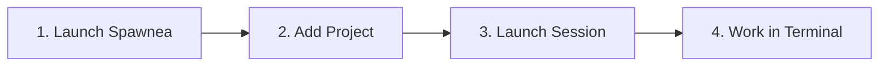

# Getting Started with Spawnea

This guide walks through opening a local project in Spawnea, selecting an installed coding harness, and starting your first agent session.

---

## Quick Requirements

Before starting, ensure you have:

1. Built Spawnea locally following the [Installation Guide](install-and-configure.md).
2. Installed `tmux` on your local system (`tmux -V`).
3. Installed whichever CLI coding harness you want to use (such as Claude Code, Codex, Hermes, Antigravity, or your standard shell) and confirmed it runs from your terminal.

---

## Step-by-Step: Your First Local Session



### 1. Start Spawnea

Run Spawnea from the repository root:

```bash
pnpm start
```

*(For developers editing source code, `pnpm dev` runs with live reload.)*

### 2. Register Your Local Project

If this is your first run, register your project repository:

1. Click **Add Project** (the folder icon with a plus) in the sidebar or navigation rail.
2. Choose your local host (usually `Local Workstation` or `localhost`).
3. Enter a Project ID (e.g., `my-project`), a display name, and the local path to your project folder (e.g., `~/code/my-project`).
4. (Optional) Set or discover the default base branch (e.g., `main`).
5. Click **Add Project**.

This saves the project to your active operational catalog (by default `~/.config/spawnea/config.yaml`). You can also configure projects directly in that file.

### 3. Verify Your Coding Harness

Spawnea does not install or bundle AI harnesses. It executes whichever CLI command you configure.

Before creating a session, verify in your terminal that your chosen harness runs:

```bash
# Example: Claude Code
claude --version

# Example: Codex CLI
codex --version

# Example: Interactive shell
echo $SHELL
```

By default, Spawnea includes standard harness profiles for local workstations. You can also run the **Discover local setup** tool in the app to scan for installed allowlisted CLIs.

### 4. Create an Agent Session

1. In Spawnea, click **New Session** (or the terminal icon with a plus).
2. Select your **Target Host** (Local).
3. Select your **Project Root**.
4. Select your **Agent Harness** (e.g., Claude Code, Codex, or Shell).
5. Enter a **Task Description** (e.g., `Refactor auth middleware`).
6. Click **Launch Session**.

Spawnea creates a dedicated, persistent `tmux` session in the background and attaches the integrated terminal.

### 5. Work in the Integrated Terminal

Your session is now active:

- Type directly into the terminal just as you would in your normal shell.
- Monitor attention badges in the sidebar to see if the session is **working**, **needs input**, or is **idle**.
- Browse project files in the file explorer and review uncommitted changes in the Git diff panel.

Because the session runs inside `tmux`, you can close Spawnea at any time. When you reopen the app, your agent and shell processes are still running exactly where you left them.

---

## Working with Remote Projects

If your project lives on a remote Linux server rather than your local machine:

1. Confirm you can reach the server with standard SSH (`ssh user@hostname`).
2. Verify `tmux` is installed on the remote machine (`which tmux`).
3. Follow the [SSH Connections Guide](ssh.md) to register the remote host and launch remote sessions.

You do not need to install Spawnea on the remote machine. Spawnea operates entirely over SSH and standard `tmux`.

---

## Next Steps

- **[Git Worktrees](git-worktrees.md)**: Learn how to isolate parallel tasks in dedicated worktrees so concurrent sessions do not conflict on the same branch.
- **[Installation & Configuration](install-and-configure.md)**: Details on catalog options, environment variables, and troubleshooting.
