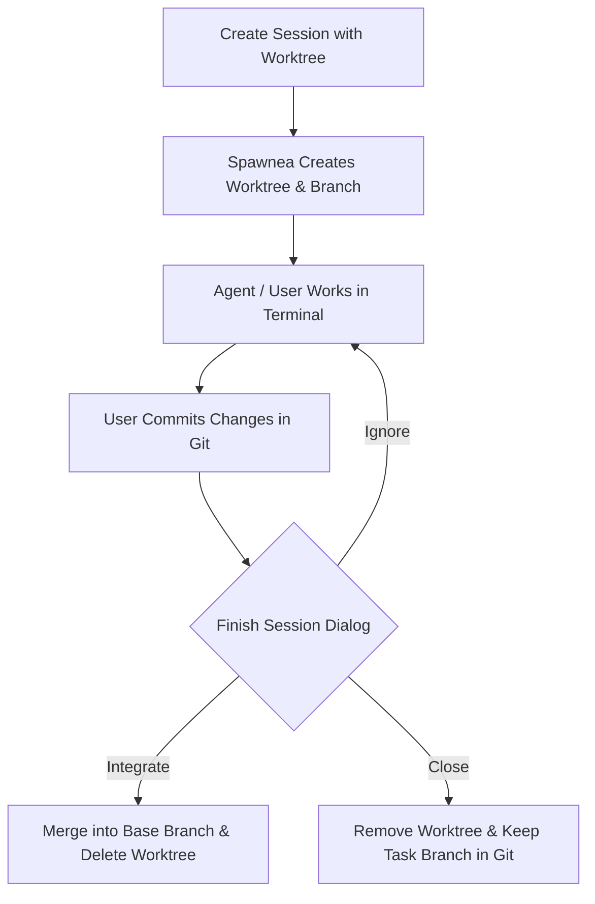

# Working with Git Worktrees in Spawnea

A Git worktree is an additional working directory linked to your existing Git repository. Worktrees allow you to check out multiple branches at the same time in separate folders, sharing the same repository history and `.git` storage without re-cloning the repository, while giving each worktree its own working files.

In Spawnea, Git worktrees allow multiple agent sessions to run in parallel on different tasks without branch collisions or stepping on each other's uncommitted work.

---

## The Worktree Lifecycle in Spawnea



---

## Configuring Worktree Support

To use worktrees for a project, enable the feature in your `~/.config/spawnea/config.yaml`:

```yaml
projects:
  my-project:
    name: My Project
    path: ~/code/my-project
    base_branch: main        # Default branch used when branching
    worktree:
      enabled: true          # Enables the worktree checkbox in Spawnea
      copy_files:            # Optional non-secret files copied from project root into new worktrees
        - .env.example
        - .envrc.custom
    enabled: true
```

> [!CAUTION]
> Do not list files containing sensitive credentials or uncommitted secrets in `copy_files`. Plaintext secret files copied into worktrees can inadvertently be committed by agents.

If `worktree.enabled` is `false` or omitted in `config.yaml`, the session runs directly in the main project root folder.

---

## Step-by-Step Workflow

### 1. Launch a Worktree Session

1. In Spawnea, click **New Session**.
2. Select your host and project.
3. Check the **Run in isolated Git Worktree** option.
4. (Optional) Specify a **Base Branch** (defaults to the project's base branch or `main`).
5. Enter your task description (e.g., `Update database migrations`) and click **Launch Session**.

Spawnea automatically:
- Creates a dedicated task branch named `spawnea/<task-slug>`.
- Creates a worktree directory at `<project-path>__worktrees/<task-slug>`.
- Copies any configured `copy_files` that exist in the project root into the new worktree (missing entries are safely skipped).
- Starts a persistent `tmux` session pointed at that worktree directory.

### 2. Work and Commit Changes

- Interact with your agent or shell in the integrated terminal.
- Review diffs in Spawnea's Git Diff viewer as files are modified.
- Use normal Git commands (`git add`, `git commit`) to commit your changes inside the worktree terminal.

### 3. Finalize the Worktree Session

When your task is complete or you are ready to conclude the session, open the **Finish Worktree Session** dialog from the session controls.

Spawnea provides three explicit outcomes:

1. **Integrate into `<baseBranch>`**:
   - Merges the session branch (`spawnea/<slug>`) into your base branch.
   - Stops the session and kills its `tmux` process.
   - Deletes the worktree folder.
   - Deletes the merged task branch.
2. **Close Worktree (Keep Task Branch)**:
   - Stops the session and removes the worktree folder from disk.
   - **Preserves the task branch in Git**, allowing you to inspect it, push it, or open a pull request later.
   - If uncommitted changes exist, Spawnea allows you to save them into a named Git stash (`Spawnea worktree: <taskBranch>`) or explicitly confirm discarding them.
3. **Ignore / Keep Working**:
   - Dismisses the dialog without making any changes to files, Git branches, or running sessions.

---

## Operational Principles

- **One Session, One Worktree**: Each parallel session operates in its own isolated worktree folder and dedicated branch.
- **Explicit Lifecycle**: Spawnea never silently deletes or merges work. Merges, branch deletions, and worktree removals occur only when you trigger them explicitly.
- **No Automatic Conflict Merges**: If integrating into the base branch causes a Git conflict, Spawnea halts safely and reports the error. It does not force-push or create broken merge commits.
- **Verify Before Closing**: Always verify your commits before discarding uncommitted worktree changes.

---

## Further Reading

For a detailed visual explanation of the Git worktree model, see [Workmux's guide to Git worktrees](https://workmux.raine.dev/guide/#why-git-worktrees).  
*(Note: Spawnea is an independent desktop application and does not depend on or use Workmux.)*

---

## Troubleshooting

### "Worktree already integrated"

If the dialog indicates the branch is already integrated:
- This occurs when the commits from the task branch are already present in the base branch (e.g. merged via terminal or cherry-picked into the base branch).
- Select **Close Worktree** to safely remove the worktree folder.

### Merge Conflicts During Integration

If **Integrate into `<baseBranch>`** (button: **Integrate & Clean Up**) fails with a merge error:
- The base branch has moved forward with conflicting changes.
- Switch to the worktree terminal and run `git merge <baseBranch>` to resolve the conflict manually, or choose **Close Worktree (Keep Task Branch)** to preserve the branch and resolve it later.

### Uncommitted Changes on Close

If you want to close a session but haven't committed all files:
- Check the **Save changes in a Git stash before closing** checkbox in the dialog. Spawnea creates a stash tagged with the branch name before removing the directory.
