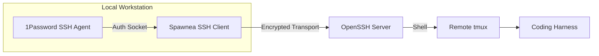

# Using the 1Password SSH Agent with Spawnea

Spawnea can authenticate SSH connections using the [1Password SSH Agent](https://developer.1password.com/docs/ssh/agent/). This setup is completely optional—1Password is not a dependency of Spawnea.

When configured, Spawnea delegates authentication to 1Password's agent socket. Spawnea never sees, reads, or stores your private SSH keys.

---

## Authentication Flow

The connection flow is identical to standard SSH, except local key signing is performed by 1Password:



1Password prompts you for authorization (e.g., biometric approval or master password) when Spawnea initiates an SSH connection, and Spawnea consumes the signed handshake over the agent socket.

---

## Prerequisites and Setup

Follow the official [1Password SSH Agent documentation](https://developer.1password.com/docs/ssh/get-started/) to enable and configure the agent:

1. **Enable the SSH Agent in 1Password**:
   - Open 1Password desktop app.
   - Go to **Settings > Developer**.
   - Turn on **Use the SSH agent**.
2. **Add an SSH Key to 1Password**:
   - Create or import your SSH key as an **SSH Key** item in your 1Password vault. By default, 1Password serves keys from your Personal, Private, or Employee vaults (refer to [1Password agent configuration](https://developer.1password.com/docs/ssh/agent/config/) to configure `~/.config/1Password/ssh/agent.toml` if using custom or shared vaults).
3. **Configure OpenSSH (`~/.ssh/config`)**:
   Add the `IdentityAgent` directive to your `~/.ssh/config`. For example:

   **On Linux**:
   ```ssh-config
   Host *
       IdentityAgent ~/.1password/agent.sock
   ```

   **On macOS**:
   ```ssh-config
   Host *
       IdentityAgent "~/Library/Group Containers/2BUA8C4S2C.com.1password/t/agent.sock"
   ```

   *(Refer to [1Password documentation](https://developer.1password.com/docs/ssh/agent/config/) for Windows or custom socket paths.)*

---

## Verifying the Agent Before Using Spawnea

Before launching Spawnea, verify that 1Password is serving your keys in your standard terminal:

1. Unlock 1Password.
2. Connect to your target server once from the terminal:
   ```bash
   ssh dev-box
   ```
   1Password should display an authorization prompt. Approve it and confirm you can log in.
3. (Optional) Inspect loaded keys via the socket:
   ```bash
   # On Linux:
   SSH_AUTH_SOCK=~/.1password/agent.sock ssh-add -l

   # On macOS:
   SSH_AUTH_SOCK="$HOME/Library/Group Containers/2BUA8C4S2C.com.1password/t/agent.sock" ssh-add -l
   ```
   You should see your 1Password SSH key listed with a comment from 1Password.

---

## Using with Spawnea

Once verified outside Spawnea, no special Spawnea configuration is required:

1. Spawnea reads `~/.ssh/config` when preparing remote connections.
2. If `IdentityAgent` is configured for the host, Spawnea connects directly to that socket.
3. If no `IdentityAgent` is specified in config, Spawnea falls back to the `SSH_AUTH_SOCK` environment variable.
4. When you launch a session on that remote host, 1Password prompts for your authorization as normal.

Follow the normal steps in the [SSH Connections Guide](ssh.md) to register the host and launch sessions.

---

## Security Reminders

- **Strict Host Verification Still Applies**: 1Password authenticates *you* to the server. Spawnea still verifies the *server's* identity against `~/.ssh/known_hosts`. Both must succeed.
- **Zero Key Access**: Spawnea never prompts for or stores private keys. All signing happens in the 1Password process.

---

## Troubleshooting

### "Authentication failed" or Agent Socket Not Found

- **1Password is locked or closed**: Ensure 1Password is running and unlocked before connecting in Spawnea.
- **Socket path mismatch**: Verify the socket exists on disk:
  - Linux: `ls -l ~/.1password/agent.sock`
  - macOS: `ls -l "$HOME/Library/Group Containers/2BUA8C4S2C.com.1password/t/agent.sock"`
- **Launcher environment**: If you launched Spawnea from an application launcher that does not export `SSH_AUTH_SOCK`, ensure `IdentityAgent` is set explicitly in `~/.ssh/config`. Spawnea parses `~/.ssh/config` directly.

### 1Password Does Not Prompt for Approval

- Verify `ssh-add -l` in your terminal shows your key. If empty, check the item in 1Password and ensure **Use for SSH** is checked.
- Check that your `~/.ssh/config` host block matches the target host alias used in `config.yaml`.

### Host Verification Fails

- Host verification errors are unrelated to 1Password. Connect via standard terminal `ssh <target>` once to record the server's public key in `~/.ssh/known_hosts`.
