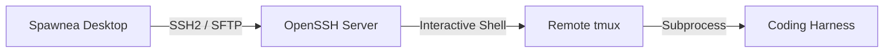

# Remote SSH Connections

Spawnea connects to remote Linux machines using standard OpenSSH protocols and remote `tmux`. It requires no custom background daemon, agent plugin, or software installation on the remote server.

---

## Architecture Overview

Spawnea runs entirely on your local workstation and drives remote execution through standard SSH and `tmux`:



When you close or restart Spawnea, the remote `tmux` session and your coding harness continue running on the server undisturbed.

---

## Connecting to a Remote Project

### 1. Verify SSH Outside Spawnea

Before opening Spawnea, verify that you can connect to your remote host from your normal command line:

```bash
ssh user@example-host
```

If you use an alias in `~/.ssh/config`, verify with that alias:

```bash
ssh dev-box
```

### 2. Confirm Remote Prerequisites

While logged into the remote host, check two things:

1. **`tmux` is installed**:
   ```bash
   tmux -V
   ```
   If missing, install it using the host's package manager (`sudo apt install tmux`, `dnf install tmux`, etc.).
2. **Your coding harness is installed**:
   Confirm the command you intend to run (e.g., `claude`, `codex`, `hermes`, or your shell) is present in the remote user's `$PATH`.

### 3. Register the Host and Project in Spawnea

In your `~/.config/spawnea/config.yaml`, add the host and project definition under `hosts`:

```yaml
version: 1

hosts:
  dev-server:
    name: Cloud Dev Server
    enabled: true
    ssh:
      target: dev-box       # Hostname, IP, or ~/.ssh/config alias
      user: developer       # Optional if defined in ~/.ssh/config
      port: 22

    projects:
      api-service:
        name: API Service
        path: ~/code/api-service
        base_branch: main
        enabled: true

    harnesses:
      claude:
        name: Claude Code
        command: claude
        args: []
        enabled: true
```

Save the file. If Spawnea is already open, reload the catalog or restart the application.

### 4. Create and Attach to the Session

1. In Spawnea, click **New Session**.
2. Select your remote host from the **Target Host** menu. Click **Test Connection** if you want to verify reachability.
3. Choose the project and harness.
4. Enter the task description and click **Launch Session**.

Spawnea connects over SSH, verifies the server identity, starts a persistent `tmux` session in the project directory, launches the harness command, and binds the integrated terminal.

---

## Security Boundaries and Practices

Spawnea adheres to strict operational boundaries for remote machines:

1. **Strict `known_hosts` Verification**:
   - Every SSH connection verifies the server's public key against your local `~/.ssh/known_hosts` file.
   - Connections to unknown hosts or hosts with mismatched/changed keys are **immediately rejected**.
   - Spawnea does not use trust-on-first-use (TOFU) and never prompts you to accept an unverified key blindly. Connect once with standard OpenSSH in your terminal first to populate `known_hosts`.
2. **Zero Credential Storage**:
   - Spawnea never stores SSH passwords, passphrases, or private keys.
   - Authentication is handled exclusively by your system SSH configuration, SSH Agent (`SSH_AUTH_SOCK`), or 1Password (`IdentityAgent`).
3. **Zero Remote Footprint**:
   - Spawnea installs no software, background daemons, packages, or services on remote machines.
   - Spawnea does not alter `sshd_config`, firewall rules, `~/.ssh/authorized_keys`, shell initialization files (`.bashrc`, `.zshrc`), or global agent configs.
   - Status detection runs strictly in-memory by inspecting output from `tmux capture-pane`.

---

## Troubleshooting

### Host Key Verification Failed

If Spawnea fails to connect with an error about host verification:

- **Host not in `known_hosts`**: Connect to the host once using your system terminal (`ssh user@hostname`). Verify the key fingerprint and allow OpenSSH to save it to `~/.ssh/known_hosts`.
- **Host key changed**: If the server was re-imaged and has a new key, update your `~/.ssh/known_hosts` entry after confirming the change is legitimate.

### Authentication Failed / Agent Not Found

- If you use an SSH key with a passphrase, ensure `ssh-agent` is running and your key is loaded:
  ```bash
  ssh-add -l
  ```
- If you use 1Password to manage SSH keys, see the [SSH with 1Password Guide](ssh-with-1password.md).

### Remote `tmux` Missing

If Spawnea reports `tmux is not installed or not in PATH on host`:

- Connect to the remote server manually and install `tmux`. Spawnea does not install remote packages.

### Remote Path Does Not Exist

- Double check the `path` field in `config.yaml`. Remote paths should point to the repository on the target host (e.g. `~/code/project`), since GUI folder pickers cannot browse remote filesystems before connecting.
